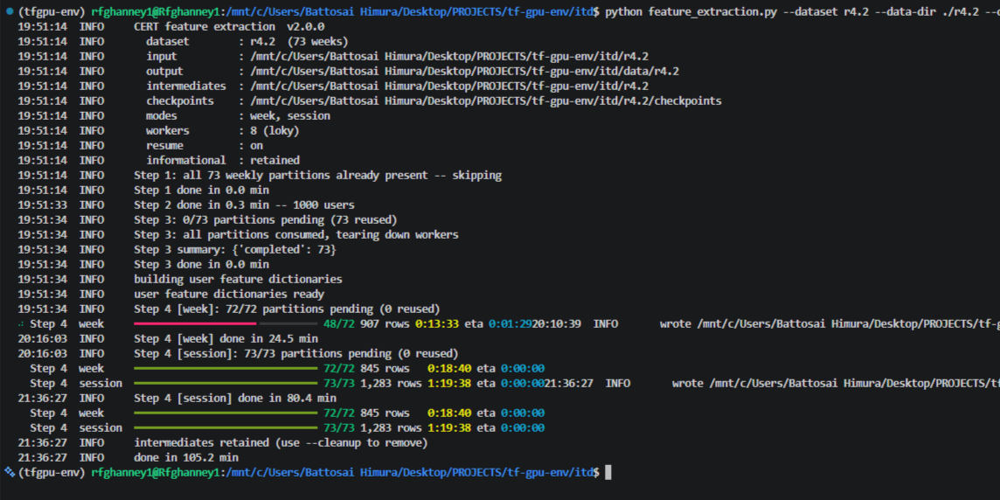
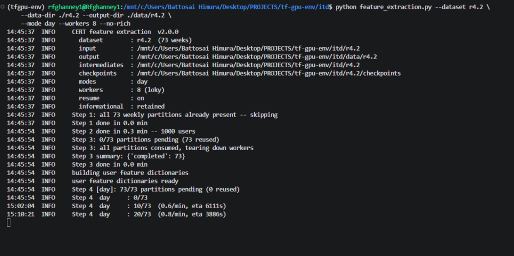

# CERT Feature Extraction (v2.0.0)

Feature extraction for the CMU CERT Insider Threat Test Dataset (**r4.1–r6.2**), all temporal modes (**week, day, session, subsession**).

A performance and reliability modernisation of the original extractor by Le, Zincir-Heywood and Heywood. **Feature semantics are unchanged** — same features, same names, same order, same labels. Only the machinery around them was rewritten. The original script cannot run on a current Python/pandas stack, offers no progress reporting, cannot resume after an interruption, always computes all four temporal modes even when one is wanted, and re-scans the same data repeatedly. On r6.2 (135M events, ~22 GB) this makes a single run impractical.

<p align="left">
  <h4>Resume run with rich progress bar enabled :</h4>
  
  <br>
  <h4>Resumed run with rich progress bar disabled (i.e, --no-rich specified) :</h4>
  
</p>

---

## Update

### Correctness / compatibility
- Fixed four pandas ≥2.0 blockers: `df.drop('id', 1)`, `DataFrame.append`, `.at[]` with a boolean mask, `strftime('%s')`.
- Replaced `wget` / `tar` / `head` / `rm` shell-outs with pure Python — runs on Linux, macOS and Windows.

### Data processing
- **Step 1:** week assignment cached on the date prefix — ~135M `strptime` calls become ~516.
- **Step 1:** `DataFrame.append` loop (quadratic) replaced with a single `concat`.
- **Step 3:** per-user full scans replaced with one `groupby`.
- **Step 3:** rows materialised once as dicts instead of a fresh `Series` per action.
- **Step 3:** USB connect/disconnect lookup was quadratic per user; now per-PC index arrays + binary search.
- **Step 4:** `w[w['user']==v]` and `uactw[uactw['day']==d]` loops replaced with `groupby`.
- Consolidation streams week-by-week instead of holding the whole release in memory.

### Reliability
- SQLite checkpointing per (stage, mode, week); `--resume` skips completed work.
- Atomic output: write → validate → rename. A filename alone never marks a task complete.
- One failed week does not kill the run; it is recorded and retried on resume.
- Intermediates retained by default; deletion is explicit via `--cleanup`.

### Selective work
- `--mode day` computes **only** day. The original always ran all four modes.
- Existing Step 3 output is reused when only the temporal mode changes.

### Parallelisation
- Backend remains joblib/loky — **not** replaced speculatively.
- `--workers N|auto`, `--backend`, and `--benchmark` to measure worker scaling on real partitions before a long run.

### Observability
- `rich` progress with per-partition completion and ETA from observed durations; falls back to log lines when piped or with `--no-rich`.
- Standard `logging`, `--log-level`, `--log-file`.
- `run_metadata.json` per run: dataset, modes, workers, library versions, per-stage timings, completed/failed partitions.

---

## Install

```bash
pip install -r requirements.txt     
```
Python ≥ 3.9.

---

## Usage

```bash
usage: feature_extraction.py [-h] [--data-dir DATA_DIR] [--dataset {r4.1,r4.2,r5.1,r5.2,r6.1,r6.2}] [--mode {week,day,session,subsession,all} [{week,day,session,subsession,all} ...]]
                             [--subsession-time SUBSESSION_TIME [SUBSESSION_TIME ...]] [--subsession-actions SUBSESSION_ACTIONS [SUBSESSION_ACTIONS ...]] [--workers WORKERS]
                             [--backend {loky,threading,multiprocessing}] [--resume] [--no-resume] [--benchmark] [--output-dir OUTPUT_DIR] [--intermediate-dir INTERMEDIATE_DIR]
                             [--checkpoint-dir CHECKPOINT_DIR] [--drop-informational] [--cleanup] [--log-level {DEBUG,INFO,WARNING,ERROR,CRITICAL}] [--log-file LOG_FILE] [--no-rich] [--quiet]
                             [--version]

Extract features from the CERT Insider Threat Test Dataset (r4.1-r6.2).
Run from inside a decompressed dataset folder, or pass --data-dir.

options:
  -h, --help            show this help message and exit

dataset and modes:
  --data-dir DATA_DIR   CERT dataset folder (default: current directory)
  --dataset {r4.1,r4.2,r5.1,r5.2,r6.1,r6.2}
                        release name; inferred from the folder name if omitted
  --mode {week,day,session,subsession,all} [{week,day,session,subsession,all} ...]
                        temporal representations to extract (default: all)
  --subsession-time SUBSESSION_TIME [SUBSESSION_TIME ...]
                        subsession durations in minutes (default: 120 240)
  --subsession-actions SUBSESSION_ACTIONS [SUBSESSION_ACTIONS ...]
                        subsession sizes in actions (default: 25 50)

execution:
  --workers WORKERS     worker processes, or 'auto' (default: 8)
  --backend {loky,threading,multiprocessing}
                        joblib backend (default: loky)
  --resume              skip partitions already marked complete (default)
  --no-resume           recompute everything, ignoring checkpoints
  --benchmark           time Step 4 across worker counts, then exit

paths:
  --output-dir OUTPUT_DIR
                        final CSVs (default: <data-dir>/ExtractedData)
  --intermediate-dir INTERMEDIATE_DIR
                        DataByWeek/NumDataByWeek/tmp parent (default: <data-dir>)
  --checkpoint-dir CHECKPOINT_DIR
                        checkpoint database (default: <data-dir>/checkpoints)

output:
  --drop-informational  drop subs_ind, starttime, endtime, sessionid, user, day, week from the CSVs. Ignored for --mode all. Never drops `insider`.
  --cleanup             delete intermediates after a successful run (default: keep, so re-runs are cheap)

logging:
  --log-level {DEBUG,INFO,WARNING,ERROR,CRITICAL}
  --log-file LOG_FILE
  --no-rich             plain log-line progress instead of a live bar
  --quiet
  --version             show program version number and exit

see example(s) usage @: python feature_extraction.py --help
```

---

## Data directory:


```bash
<data-dir>/
├── DataByWeek/         Step 1 intermediates   (--intermediate-dir)
├── NumDataByWeek/      Step 3 intermediates   (--intermediate-dir)
├── tmp/                Step 4 per-week parts  (--intermediate-dir)
├── checkpoints/        checkpoints.sqlite     (--checkpoint-dir)
└── ExtractedData/      final CSVs + metadata  (--output-dir)
```

---

## Notes

**Reproducibility.** Output is intended to be identical to the original. Before relying on it, run both on a couple of weeks and diff column names, row counts, dtypes and feature values (floats within tolerance).

**One preserved quirk.** In the original, the USB connect-duration search window starts *at* the current Connect action rather than after it, so `usb_dur` returns `-1` far more often than the code appears to intend. This is reproduced deliberately — every published result using this extractor contains it, and "fixing" it would break comparability. See `_connect_duration` in the script.

**Trailing newlines.** Step 3 compares device activity against the literal `'Connect\n'` / `'Disconnect\n'`. Step 1 therefore still splits raw lines rather than using `pd.read_csv`, which would strip the newline and silently zero out every `usb_dur`.

---

## Attribution

Original research, feature design and implementation:

> D. C. Le, N. Zincir-Heywood and M. I. Heywood, "Analyzing Data Granularity Levels for Insider Threat Detection Using Machine Learning," *IEEE Transactions on Network and Service Management*, vol. 17, no. 1, pp. 30–44, March 2020. doi:10.1109/TNSM.2020.2967721

Original repository: https://github.com/lcd-dal/feature-extraction-for-CERT-insider-threat-test-datasets

Dataset:

> B. Lindauer, *Insider Threat Test Dataset*, Carnegie Mellon University, 2020. doi:10.1184/R1/12841247.v1
>
> J. Glasser and B. Lindauer, "Bridging the Gap: A Pragmatic Approach to Generating Insider Threat Data," *IEEE Security and Privacy Workshops*, 2013, pp. 98–104. doi:10.1109/SPW.2013.37

Modernisation and engineering work:

> Gharnie01 — https://github.com/Gharnie01

### Citing

If you use the extracted data or the original feature design, **cite the TNSM 2020 paper** — this is required by the original repository and is not optional.

If you use this modernised implementation, please additionally cite it:

```bibtex
@software{gharnie01_cert_feature_extraction,
  author  = {Gharnie01},
  title   = {CERT Feature Extraction (modernised): a resumable, observable
             reimplementation of the CERT insider-threat feature extractor},
  year    = {2026},
  url     = {https://github.com/Gharnie01},
  note    = {Modernisation of Le, Zincir-Heywood and Heywood (TNSM 2020).
             Feature semantics unchanged.}
}
```

## Licence

MIT, following the original repository. The CERT dataset carries its own copyright and licence terms — see the dataset distribution.
